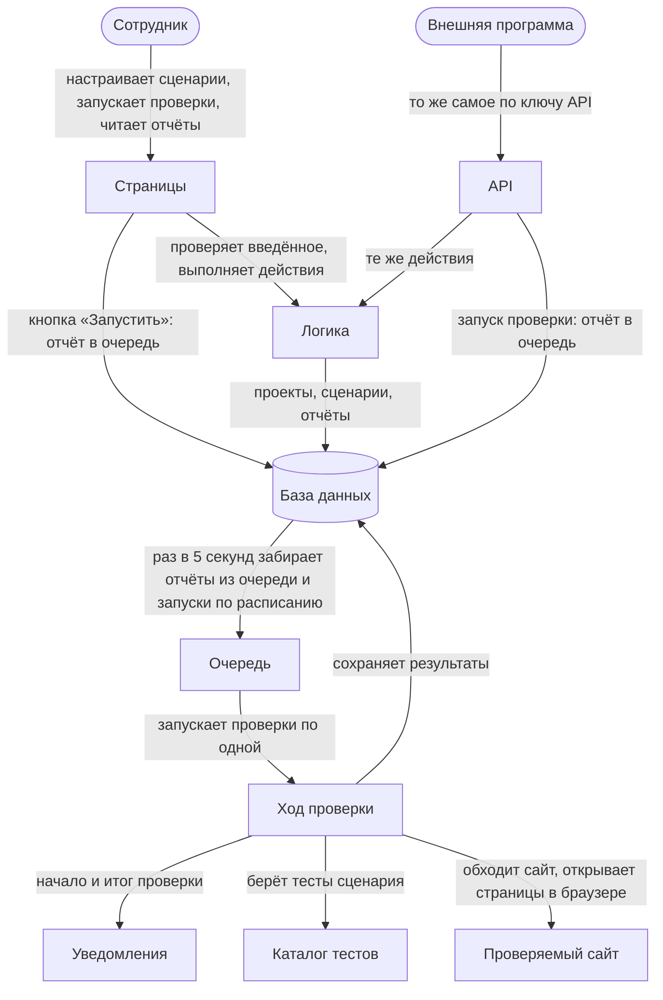

## Схема проекта

```mermaid
flowchart TD
  user([Сотрудник])
  client([Внешняя программа])
  pages[Страницы]
  api[API]
  logic[Логика]
  db[(База данных)]
  queue[Очередь]
  run[Ход проверки]
  notify[Уведомления]
  tests[Каталог тестов]
  site[Проверяемый сайт]

  user -->|настраивает сценарии, запускает проверки, читает отчёты| pages
  client -->|то же самое по ключу API| api
  pages -->|кнопка «Запустить»: отчёт в очередь| db
  pages -->|проверяет введённое, выполняет действия| logic
  api -->|те же действия| logic
  api -->|запуск проверки: отчёт в очередь| db
  logic -->|проекты, сценарии, отчёты| db
  db -->|раз в 5 секунд забирает отчёты из очереди и запуски по расписанию| queue
  queue -->|запускает проверки по одной| run
  run -->|начало и итог проверки| notify
  run -->|берёт тесты сценария| tests
  run -->|обходит сайт, открывает страницы в браузере| site
  run -->|сохраняет результаты| db
```
